# [📈 Live Status](https://windstatus.github.io/Control-D-DNS-status-uptime-monitor): <!--live status--> **🟩 All systems operational**

This repository contains the open-source uptime monitor and status page for [windstatus](https://windstatus.github.io/Control-D-DNS-status-uptime-monitor), powered by [Upptime](https://github.com/upptime/upptime).

With [Upptime](https://upptime.js.org), you can get your own unlimited and free uptime monitor and status page, powered entirely by a GitHub repository. We use [Issues](https://github.com/windstatus/Control-D-DNS-status-uptime-monitor/issues) as incident reports, [Actions](https://github.com/windstatus/Control-D-DNS-status-uptime-monitor/actions) as uptime monitors, and [Pages](https://windstatus.github.io/Control-D-DNS-status-uptime-monitor) for the status page.

<!--start: status pages-->
<!-- This summary is generated by Upptime (https://github.com/upptime/upptime) -->
<!-- Do not edit this manually, your changes will be overwritten -->
<!-- prettier-ignore -->
| URL | Status | History | Response Time | Uptime |
| --- | ------ | ------- | ------------- | ------ |
|  [AMS - API](https://controld-network-api.ncprelief.eu.org?iata_code=AMS&status=api) | 🟩 Up | [ams-api.yml](https://github.com/windstatus/Control-D-DNS-status-uptime-monitor/commits/HEAD/history/ams-api.yml) | 

 493ms
     
 | 

<a href="https://windstatus.github.io/Control-D-DNS-status-uptime-monitor/history/ams-api">100.00%</a>
    

|  [AMS - DNS](https://controld-network-api.ncprelief.eu.org?iata_code=AMS&status=dns) | 🟩 Up | [ams-dns.yml](https://github.com/windstatus/Control-D-DNS-status-uptime-monitor/commits/HEAD/history/ams-dns.yml) | 

 107ms
     
 | 

<a href="https://windstatus.github.io/Control-D-DNS-status-uptime-monitor/history/ams-dns">100.00%</a>
    

|  [AMS - Proxy](https://controld-network-api.ncprelief.eu.org?iata_code=AMS&status=pxy) | 🟩 Up | [ams-proxy.yml](https://github.com/windstatus/Control-D-DNS-status-uptime-monitor/commits/HEAD/history/ams-proxy.yml) | 

 108ms
     
 | 

<a href="https://windstatus.github.io/Control-D-DNS-status-uptime-monitor/history/ams-proxy">100.00%</a>
    

|  [BMA - API](https://controld-network-api.ncprelief.eu.org?iata_code=BMA&status=api) | 🟩 Up | [bma-api.yml](https://github.com/windstatus/Control-D-DNS-status-uptime-monitor/commits/HEAD/history/bma-api.yml) | 

 110ms
     
 | 

<a href="https://windstatus.github.io/Control-D-DNS-status-uptime-monitor/history/bma-api">100.00%</a>
    

|  [BMA - DNS](https://controld-network-api.ncprelief.eu.org?iata_code=BMA&status=dns) | 🟩 Up | [bma-dns.yml](https://github.com/windstatus/Control-D-DNS-status-uptime-monitor/commits/HEAD/history/bma-dns.yml) | 

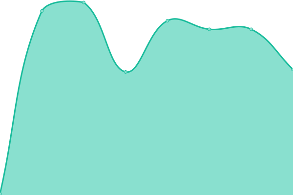 99ms
     
 | 

<a href="https://windstatus.github.io/Control-D-DNS-status-uptime-monitor/history/bma-dns">100.00%</a>
    

|  [CDG - API](https://controld-network-api.ncprelief.eu.org?iata_code=CDG&status=api) | 🟩 Up | [cdg-api.yml](https://github.com/windstatus/Control-D-DNS-status-uptime-monitor/commits/HEAD/history/cdg-api.yml) | 

 100ms
     
 | 

<a href="https://windstatus.github.io/Control-D-DNS-status-uptime-monitor/history/cdg-api">100.00%</a>
    

|  [CDG - DNS](https://controld-network-api.ncprelief.eu.org?iata_code=CDG&status=dns) | 🟩 Up | [cdg-dns.yml](https://github.com/windstatus/Control-D-DNS-status-uptime-monitor/commits/HEAD/history/cdg-dns.yml) | 

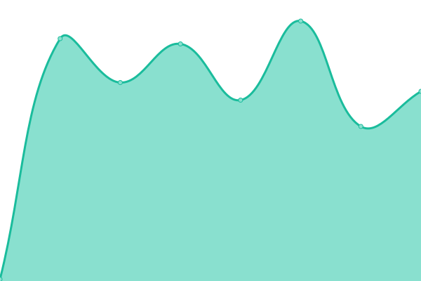 105ms
     
 | 

<a href="https://windstatus.github.io/Control-D-DNS-status-uptime-monitor/history/cdg-dns">100.00%</a>
    

|  [CDG - Proxy](https://controld-network-api.ncprelief.eu.org?iata_code=CDG&status=pxy) | 🟩 Up | [cdg-proxy.yml](https://github.com/windstatus/Control-D-DNS-status-uptime-monitor/commits/HEAD/history/cdg-proxy.yml) | 

 93ms
     
 | 

<a href="https://windstatus.github.io/Control-D-DNS-status-uptime-monitor/history/cdg-proxy">100.00%</a>
    

|  [CGH - API](https://controld-network-api.ncprelief.eu.org?iata_code=CGH&status=api) | 🟩 Up | [cgh-api.yml](https://github.com/windstatus/Control-D-DNS-status-uptime-monitor/commits/HEAD/history/cgh-api.yml) | 

 107ms
     
 | 

<a href="https://windstatus.github.io/Control-D-DNS-status-uptime-monitor/history/cgh-api">100.00%</a>
    

|  [CGH - DNS](https://controld-network-api.ncprelief.eu.org?iata_code=CGH&status=dns) | 🟩 Up | [cgh-dns.yml](https://github.com/windstatus/Control-D-DNS-status-uptime-monitor/commits/HEAD/history/cgh-dns.yml) | 

 86ms
     
 | 

<a href="https://windstatus.github.io/Control-D-DNS-status-uptime-monitor/history/cgh-dns">100.00%</a>
    

|  [CGH - Proxy](https://controld-network-api.ncprelief.eu.org?iata_code=CGH&status=pxy) | 🟩 Up | [cgh-proxy.yml](https://github.com/windstatus/Control-D-DNS-status-uptime-monitor/commits/HEAD/history/cgh-proxy.yml) | 

 108ms
     
 | 

<a href="https://windstatus.github.io/Control-D-DNS-status-uptime-monitor/history/cgh-proxy">100.00%</a>
    

|  [CHI - API](https://controld-network-api.ncprelief.eu.org?iata_code=CHI&status=api) | 🟩 Up | [chi-api.yml](https://github.com/windstatus/Control-D-DNS-status-uptime-monitor/commits/HEAD/history/chi-api.yml) | 

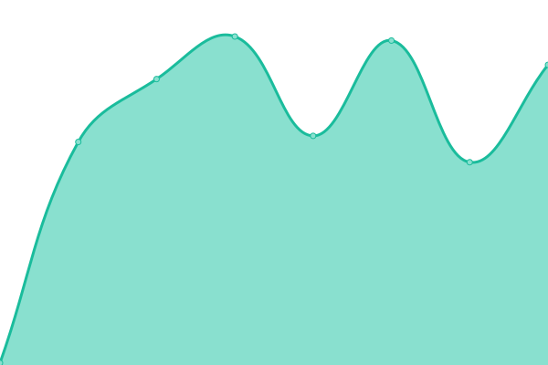 102ms
     
 | 

<a href="https://windstatus.github.io/Control-D-DNS-status-uptime-monitor/history/chi-api">100.00%</a>
    

|  [CHI - DNS](https://controld-network-api.ncprelief.eu.org?iata_code=CHI&status=dns) | 🟩 Up | [chi-dns.yml](https://github.com/windstatus/Control-D-DNS-status-uptime-monitor/commits/HEAD/history/chi-dns.yml) | 

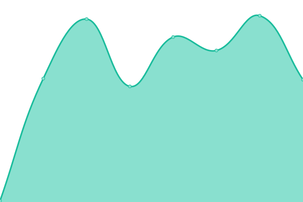 93ms
     
 | 

<a href="https://windstatus.github.io/Control-D-DNS-status-uptime-monitor/history/chi-dns">100.00%</a>
    

|  [DAL - API](https://controld-network-api.ncprelief.eu.org?iata_code=DAL&status=api) | 🟩 Up | [dal-api.yml](https://github.com/windstatus/Control-D-DNS-status-uptime-monitor/commits/HEAD/history/dal-api.yml) | 

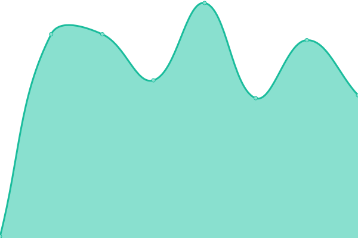 100ms
     
 | 

<a href="https://windstatus.github.io/Control-D-DNS-status-uptime-monitor/history/dal-api">100.00%</a>
    

|  [DAL - DNS](https://controld-network-api.ncprelief.eu.org?iata_code=DAL&status=dns) | 🟩 Up | [dal-dns.yml](https://github.com/windstatus/Control-D-DNS-status-uptime-monitor/commits/HEAD/history/dal-dns.yml) | 

 98ms
     
 | 

<a href="https://windstatus.github.io/Control-D-DNS-status-uptime-monitor/history/dal-dns">100.00%</a>
    

|  [DEN - API](https://controld-network-api.ncprelief.eu.org?iata_code=DEN&status=api) | 🟩 Up | [den-api.yml](https://github.com/windstatus/Control-D-DNS-status-uptime-monitor/commits/HEAD/history/den-api.yml) | 

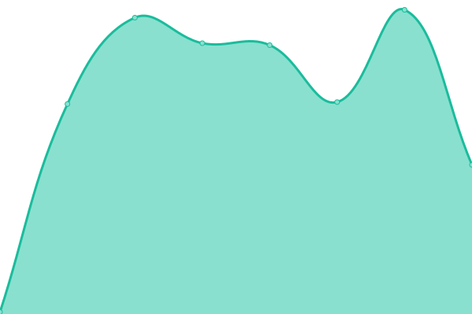 95ms
     
 | 

<a href="https://windstatus.github.io/Control-D-DNS-status-uptime-monitor/history/den-api">100.00%</a>
    

|  [DEN - DNS](https://controld-network-api.ncprelief.eu.org?iata_code=DEN&status=dns) | 🟩 Up | [den-dns.yml](https://github.com/windstatus/Control-D-DNS-status-uptime-monitor/commits/HEAD/history/den-dns.yml) | 

 92ms
     
 | 

<a href="https://windstatus.github.io/Control-D-DNS-status-uptime-monitor/history/den-dns">100.00%</a>
    

|  [DXB - API](https://controld-network-api.ncprelief.eu.org?iata_code=DXB&status=api) | 🟩 Up | [dxb-api.yml](https://github.com/windstatus/Control-D-DNS-status-uptime-monitor/commits/HEAD/history/dxb-api.yml) | 

 90ms
     
 | 

<a href="https://windstatus.github.io/Control-D-DNS-status-uptime-monitor/history/dxb-api">100.00%</a>
    

|  [DXB - DNS](https://controld-network-api.ncprelief.eu.org?iata_code=DXB&status=dns) | 🟩 Up | [dxb-dns.yml](https://github.com/windstatus/Control-D-DNS-status-uptime-monitor/commits/HEAD/history/dxb-dns.yml) | 

 98ms
     
 | 

<a href="https://windstatus.github.io/Control-D-DNS-status-uptime-monitor/history/dxb-dns">100.00%</a>
    

|  [EZE - API](https://controld-network-api.ncprelief.eu.org?iata_code=EZE&status=api) | 🟩 Up | [eze-api.yml](https://github.com/windstatus/Control-D-DNS-status-uptime-monitor/commits/HEAD/history/eze-api.yml) | 

 113ms
     
 | 

<a href="https://windstatus.github.io/Control-D-DNS-status-uptime-monitor/history/eze-api">100.00%</a>
    

|  [EZE - DNS](https://controld-network-api.ncprelief.eu.org?iata_code=EZE&status=dns) | 🟩 Up | [eze-dns.yml](https://github.com/windstatus/Control-D-DNS-status-uptime-monitor/commits/HEAD/history/eze-dns.yml) | 

 92ms
     
 | 

<a href="https://windstatus.github.io/Control-D-DNS-status-uptime-monitor/history/eze-dns">100.00%</a>
    

|  [FRA - API](https://controld-network-api.ncprelief.eu.org?iata_code=FRA&status=api) | 🟩 Up | [fra-api.yml](https://github.com/windstatus/Control-D-DNS-status-uptime-monitor/commits/HEAD/history/fra-api.yml) | 

 106ms
     
 | 

<a href="https://windstatus.github.io/Control-D-DNS-status-uptime-monitor/history/fra-api">100.00%</a>
    

|  [FRA - DNS](https://controld-network-api.ncprelief.eu.org?iata_code=FRA&status=dns) | 🟩 Up | [fra-dns.yml](https://github.com/windstatus/Control-D-DNS-status-uptime-monitor/commits/HEAD/history/fra-dns.yml) | 

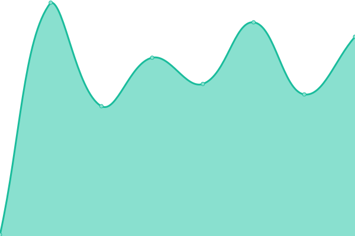 96ms
     
 | 

<a href="https://windstatus.github.io/Control-D-DNS-status-uptime-monitor/history/fra-dns">100.00%</a>
    

|  [FRA - Proxy](https://controld-network-api.ncprelief.eu.org?iata_code=FRA&status=pxy) | 🟩 Up | [fra-proxy.yml](https://github.com/windstatus/Control-D-DNS-status-uptime-monitor/commits/HEAD/history/fra-proxy.yml) | 

 93ms
     
 | 

<a href="https://windstatus.github.io/Control-D-DNS-status-uptime-monitor/history/fra-proxy">100.00%</a>
    

|  [HKG - API](https://controld-network-api.ncprelief.eu.org?iata_code=HKG&status=api) | 🟩 Up | [hkg-api.yml](https://github.com/windstatus/Control-D-DNS-status-uptime-monitor/commits/HEAD/history/hkg-api.yml) | 

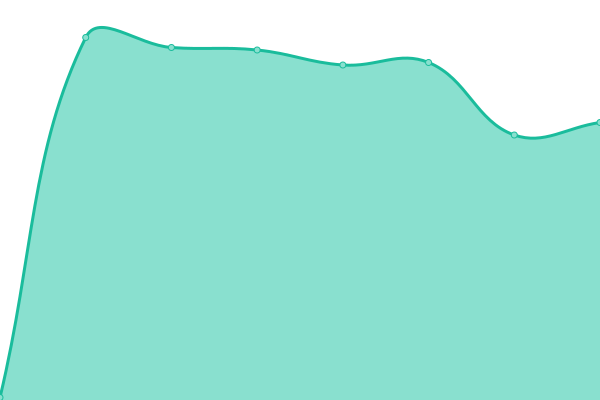 91ms
     
 | 

<a href="https://windstatus.github.io/Control-D-DNS-status-uptime-monitor/history/hkg-api">100.00%</a>
    

|  [HKG - DNS](https://controld-network-api.ncprelief.eu.org?iata_code=HKG&status=dns) | 🟩 Up | [hkg-dns.yml](https://github.com/windstatus/Control-D-DNS-status-uptime-monitor/commits/HEAD/history/hkg-dns.yml) | 

 101ms
     
 | 

<a href="https://windstatus.github.io/Control-D-DNS-status-uptime-monitor/history/hkg-dns">100.00%</a>
    

|  [IAD - API](https://controld-network-api.ncprelief.eu.org?iata_code=IAD&status=api) | 🟩 Up | [iad-api.yml](https://github.com/windstatus/Control-D-DNS-status-uptime-monitor/commits/HEAD/history/iad-api.yml) | 

 107ms
     
 | 

<a href="https://windstatus.github.io/Control-D-DNS-status-uptime-monitor/history/iad-api">100.00%</a>
    

|  [IAD - DNS](https://controld-network-api.ncprelief.eu.org?iata_code=IAD&status=dns) | 🟩 Up | [iad-dns.yml](https://github.com/windstatus/Control-D-DNS-status-uptime-monitor/commits/HEAD/history/iad-dns.yml) | 

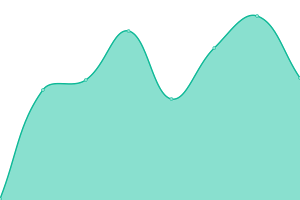 91ms
     
 | 

<a href="https://windstatus.github.io/Control-D-DNS-status-uptime-monitor/history/iad-dns">100.00%</a>
    

|  [IST - API](https://controld-network-api.ncprelief.eu.org?iata_code=IST&status=api) | 🟩 Up | [ist-api.yml](https://github.com/windstatus/Control-D-DNS-status-uptime-monitor/commits/HEAD/history/ist-api.yml) | 

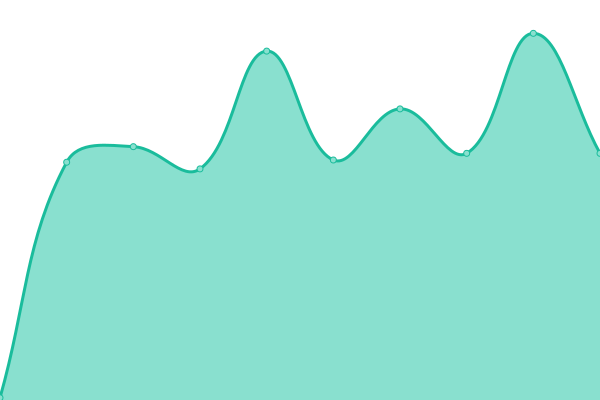 90ms
     
 | 

<a href="https://windstatus.github.io/Control-D-DNS-status-uptime-monitor/history/ist-api">100.00%</a>
    

|  [IST - DNS](https://controld-network-api.ncprelief.eu.org?iata_code=IST&status=dns) | 🟩 Up | [ist-dns.yml](https://github.com/windstatus/Control-D-DNS-status-uptime-monitor/commits/HEAD/history/ist-dns.yml) | 

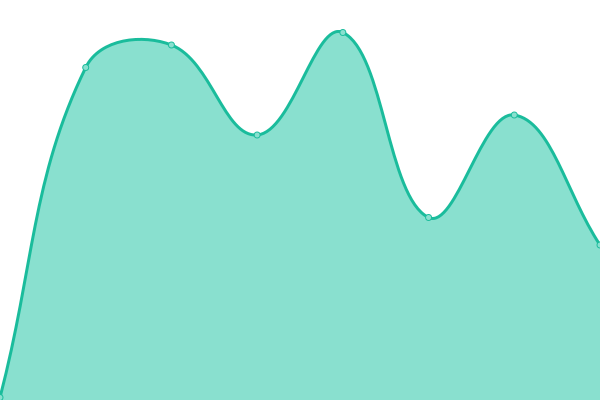 102ms
     
 | 

<a href="https://windstatus.github.io/Control-D-DNS-status-uptime-monitor/history/ist-dns">100.00%</a>
    

|  [JFK - API](https://controld-network-api.ncprelief.eu.org?iata_code=JFK&status=api) | 🟩 Up | [jfk-api.yml](https://github.com/windstatus/Control-D-DNS-status-uptime-monitor/commits/HEAD/history/jfk-api.yml) | 

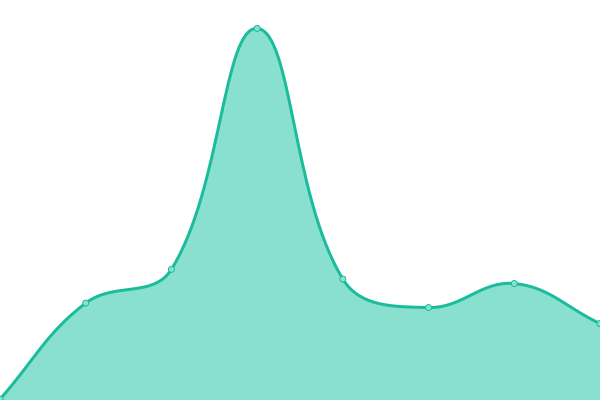 94ms
     
 | 

<a href="https://windstatus.github.io/Control-D-DNS-status-uptime-monitor/history/jfk-api">100.00%</a>
    

|  [JFK - DNS](https://controld-network-api.ncprelief.eu.org?iata_code=JFK&status=dns) | 🟩 Up | [jfk-dns.yml](https://github.com/windstatus/Control-D-DNS-status-uptime-monitor/commits/HEAD/history/jfk-dns.yml) | 

 94ms
     
 | 

<a href="https://windstatus.github.io/Control-D-DNS-status-uptime-monitor/history/jfk-dns">100.00%</a>
    

|  [JFK - Proxy](https://controld-network-api.ncprelief.eu.org?iata_code=JFK&status=pxy) | 🟩 Up | [jfk-proxy.yml](https://github.com/windstatus/Control-D-DNS-status-uptime-monitor/commits/HEAD/history/jfk-proxy.yml) | 

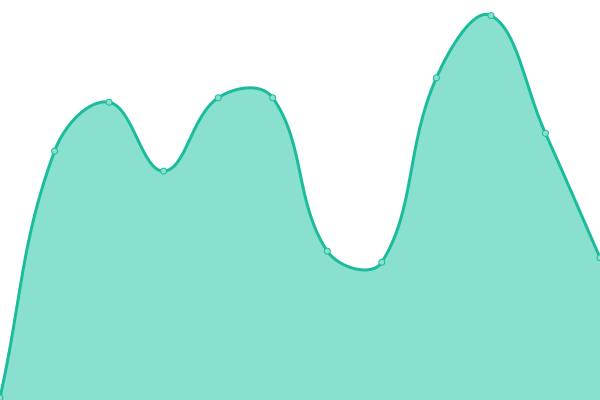 92ms
     
 | 

<a href="https://windstatus.github.io/Control-D-DNS-status-uptime-monitor/history/jfk-proxy">100.00%</a>
    

|  [JNB - API](https://controld-network-api.ncprelief.eu.org?iata_code=JNB&status=api) | 🟩 Up | [jnb-api.yml](https://github.com/windstatus/Control-D-DNS-status-uptime-monitor/commits/HEAD/history/jnb-api.yml) | 

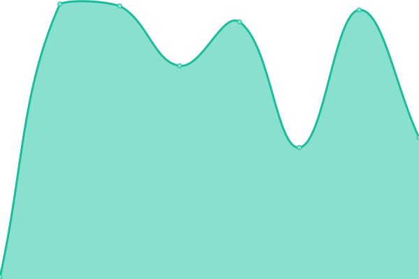 95ms
     
 | 

<a href="https://windstatus.github.io/Control-D-DNS-status-uptime-monitor/history/jnb-api">100.00%</a>
    

|  [JNB - DNS](https://controld-network-api.ncprelief.eu.org?iata_code=JNB&status=dns) | 🟩 Up | [jnb-dns.yml](https://github.com/windstatus/Control-D-DNS-status-uptime-monitor/commits/HEAD/history/jnb-dns.yml) | 

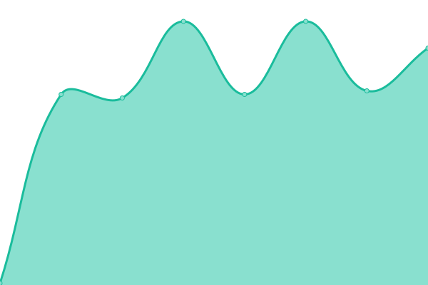 86ms
     
 | 

<a href="https://windstatus.github.io/Control-D-DNS-status-uptime-monitor/history/jnb-dns">100.00%</a>
    

|  [JNB - Proxy](https://controld-network-api.ncprelief.eu.org?iata_code=JNB&status=pxy) | 🟩 Up | [jnb-proxy.yml](https://github.com/windstatus/Control-D-DNS-status-uptime-monitor/commits/HEAD/history/jnb-proxy.yml) | 

 89ms
     
 | 

<a href="https://windstatus.github.io/Control-D-DNS-status-uptime-monitor/history/jnb-proxy">100.00%</a>
    

|  [LAX - API](https://controld-network-api.ncprelief.eu.org?iata_code=LAX&status=api) | 🟩 Up | [lax-api.yml](https://github.com/windstatus/Control-D-DNS-status-uptime-monitor/commits/HEAD/history/lax-api.yml) | 

 90ms
     
 | 

<a href="https://windstatus.github.io/Control-D-DNS-status-uptime-monitor/history/lax-api">100.00%</a>
    

|  [LAX - DNS](https://controld-network-api.ncprelief.eu.org?iata_code=LAX&status=dns) | 🟩 Up | [lax-dns.yml](https://github.com/windstatus/Control-D-DNS-status-uptime-monitor/commits/HEAD/history/lax-dns.yml) | 

 103ms
     
 | 

<a href="https://windstatus.github.io/Control-D-DNS-status-uptime-monitor/history/lax-dns">100.00%</a>
    

|  [LAX - Proxy](https://controld-network-api.ncprelief.eu.org?iata_code=LAX&status=pxy) | 🟩 Up | [lax-proxy.yml](https://github.com/windstatus/Control-D-DNS-status-uptime-monitor/commits/HEAD/history/lax-proxy.yml) | 

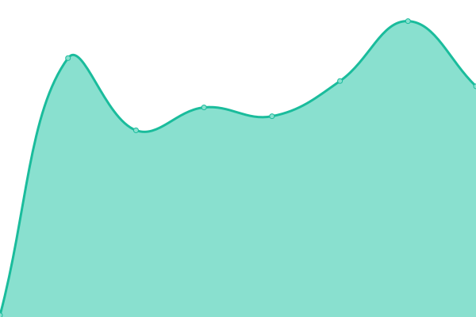 105ms
     
 | 

<a href="https://windstatus.github.io/Control-D-DNS-status-uptime-monitor/history/lax-proxy">100.00%</a>
    

|  [LHR - API](https://controld-network-api.ncprelief.eu.org?iata_code=LHR&status=api) | 🟩 Up | [lhr-api.yml](https://github.com/windstatus/Control-D-DNS-status-uptime-monitor/commits/HEAD/history/lhr-api.yml) | 

 98ms
     
 | 

<a href="https://windstatus.github.io/Control-D-DNS-status-uptime-monitor/history/lhr-api">100.00%</a>
    

|  [LHR - DNS](https://controld-network-api.ncprelief.eu.org?iata_code=LHR&status=dns) | 🟩 Up | [lhr-dns.yml](https://github.com/windstatus/Control-D-DNS-status-uptime-monitor/commits/HEAD/history/lhr-dns.yml) | 

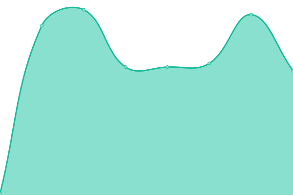 96ms
     
 | 

<a href="https://windstatus.github.io/Control-D-DNS-status-uptime-monitor/history/lhr-dns">100.00%</a>
    

|  [LHR - Proxy](https://controld-network-api.ncprelief.eu.org?iata_code=LHR&status=pxy) | 🟩 Up | [lhr-proxy.yml](https://github.com/windstatus/Control-D-DNS-status-uptime-monitor/commits/HEAD/history/lhr-proxy.yml) | 

 87ms
     
 | 

<a href="https://windstatus.github.io/Control-D-DNS-status-uptime-monitor/history/lhr-proxy">100.00%</a>
    

|  [LIM - API](https://controld-network-api.ncprelief.eu.org?iata_code=LIM&status=api) | 🟩 Up | [lim-api.yml](https://github.com/windstatus/Control-D-DNS-status-uptime-monitor/commits/HEAD/history/lim-api.yml) | 

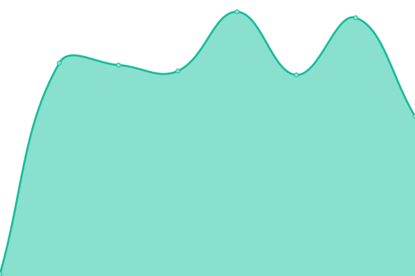 94ms
     
 | 

<a href="https://windstatus.github.io/Control-D-DNS-status-uptime-monitor/history/lim-api">100.00%</a>
    

|  [LIM - DNS](https://controld-network-api.ncprelief.eu.org?iata_code=LIM&status=dns) | 🟩 Up | [lim-dns.yml](https://github.com/windstatus/Control-D-DNS-status-uptime-monitor/commits/HEAD/history/lim-dns.yml) | 

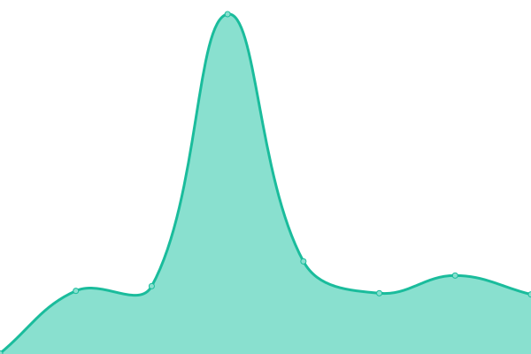 88ms
     
 | 

<a href="https://windstatus.github.io/Control-D-DNS-status-uptime-monitor/history/lim-dns">100.00%</a>
    

|  [MAD - API](https://controld-network-api.ncprelief.eu.org?iata_code=MAD&status=api) | 🟩 Up | [mad-api.yml](https://github.com/windstatus/Control-D-DNS-status-uptime-monitor/commits/HEAD/history/mad-api.yml) | 

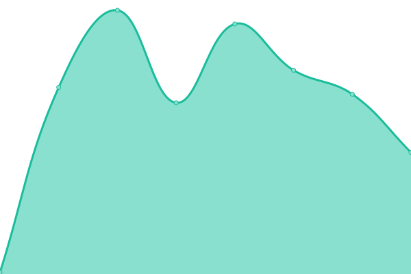 92ms
     
 | 

<a href="https://windstatus.github.io/Control-D-DNS-status-uptime-monitor/history/mad-api">100.00%</a>
    

|  [MAD - DNS](https://controld-network-api.ncprelief.eu.org?iata_code=MAD&status=dns) | 🟩 Up | [mad-dns.yml](https://github.com/windstatus/Control-D-DNS-status-uptime-monitor/commits/HEAD/history/mad-dns.yml) | 

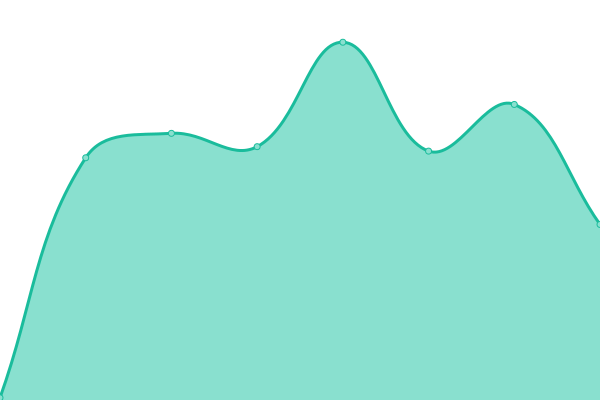 107ms
     
 | 

<a href="https://windstatus.github.io/Control-D-DNS-status-uptime-monitor/history/mad-dns">100.00%</a>
    

|  [MAN - API](https://controld-network-api.ncprelief.eu.org?iata_code=MAN&status=api) | 🟩 Up | [man-api.yml](https://github.com/windstatus/Control-D-DNS-status-uptime-monitor/commits/HEAD/history/man-api.yml) | 

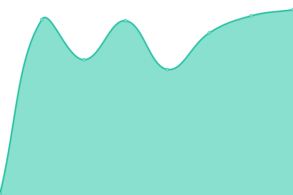 98ms
     
 | 

<a href="https://windstatus.github.io/Control-D-DNS-status-uptime-monitor/history/man-api">100.00%</a>
    

|  [MAN - DNS](https://controld-network-api.ncprelief.eu.org?iata_code=MAN&status=dns) | 🟩 Up | [man-dns.yml](https://github.com/windstatus/Control-D-DNS-status-uptime-monitor/commits/HEAD/history/man-dns.yml) | 

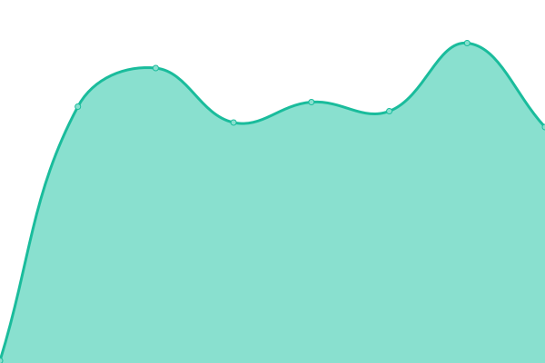 88ms
     
 | 

<a href="https://windstatus.github.io/Control-D-DNS-status-uptime-monitor/history/man-dns">100.00%</a>
    

|  [MCI - API](https://controld-network-api.ncprelief.eu.org?iata_code=MCI&status=api) | 🟩 Up | [mci-api.yml](https://github.com/windstatus/Control-D-DNS-status-uptime-monitor/commits/HEAD/history/mci-api.yml) | 

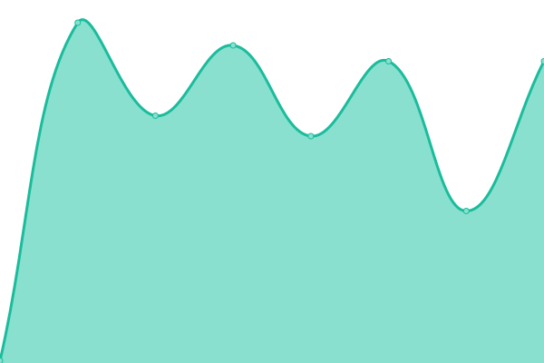 87ms
     
 | 

<a href="https://windstatus.github.io/Control-D-DNS-status-uptime-monitor/history/mci-api">100.00%</a>
    

|  [MCI - DNS](https://controld-network-api.ncprelief.eu.org?iata_code=MCI&status=dns) | 🟩 Up | [mci-dns.yml](https://github.com/windstatus/Control-D-DNS-status-uptime-monitor/commits/HEAD/history/mci-dns.yml) | 

 89ms
     
 | 

<a href="https://windstatus.github.io/Control-D-DNS-status-uptime-monitor/history/mci-dns">100.00%</a>
    

|  [MIA - API](https://controld-network-api.ncprelief.eu.org?iata_code=MIA&status=api) | 🟩 Up | [mia-api.yml](https://github.com/windstatus/Control-D-DNS-status-uptime-monitor/commits/HEAD/history/mia-api.yml) | 

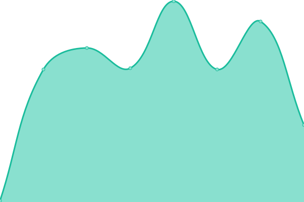 86ms
     
 | 

<a href="https://windstatus.github.io/Control-D-DNS-status-uptime-monitor/history/mia-api">100.00%</a>
    

|  [MIA - DNS](https://controld-network-api.ncprelief.eu.org?iata_code=MIA&status=dns) | 🟩 Up | [mia-dns.yml](https://github.com/windstatus/Control-D-DNS-status-uptime-monitor/commits/HEAD/history/mia-dns.yml) | 

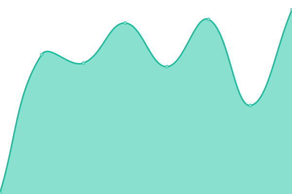 92ms
     
 | 

<a href="https://windstatus.github.io/Control-D-DNS-status-uptime-monitor/history/mia-dns">100.00%</a>
    

|  [MIA - Proxy](https://controld-network-api.ncprelief.eu.org?iata_code=MIA&status=pxy) | 🟩 Up | [mia-proxy.yml](https://github.com/windstatus/Control-D-DNS-status-uptime-monitor/commits/HEAD/history/mia-proxy.yml) | 

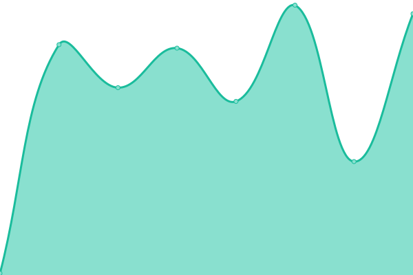 98ms
     
 | 

<a href="https://windstatus.github.io/Control-D-DNS-status-uptime-monitor/history/mia-proxy">100.00%</a>
    

|  [NRT - API](https://controld-network-api.ncprelief.eu.org?iata_code=NRT&status=api) | 🟩 Up | [nrt-api.yml](https://github.com/windstatus/Control-D-DNS-status-uptime-monitor/commits/HEAD/history/nrt-api.yml) | 

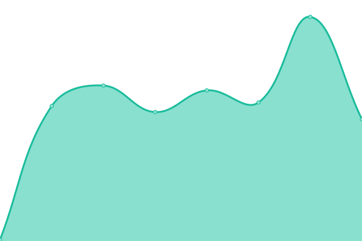 98ms
     
 | 

<a href="https://windstatus.github.io/Control-D-DNS-status-uptime-monitor/history/nrt-api">100.00%</a>
    

|  [NRT - DNS](https://controld-network-api.ncprelief.eu.org?iata_code=NRT&status=dns) | 🟩 Up | [nrt-dns.yml](https://github.com/windstatus/Control-D-DNS-status-uptime-monitor/commits/HEAD/history/nrt-dns.yml) | 

 83ms
     
 | 

<a href="https://windstatus.github.io/Control-D-DNS-status-uptime-monitor/history/nrt-dns">100.00%</a>
    

|  [NRT - Proxy](https://controld-network-api.ncprelief.eu.org?iata_code=NRT&status=pxy) | 🟩 Up | [nrt-proxy.yml](https://github.com/windstatus/Control-D-DNS-status-uptime-monitor/commits/HEAD/history/nrt-proxy.yml) | 

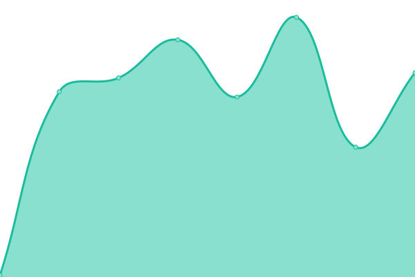 93ms
     
 | 

<a href="https://windstatus.github.io/Control-D-DNS-status-uptime-monitor/history/nrt-proxy">100.00%</a>
    

|  [OTP - API](https://controld-network-api.ncprelief.eu.org?iata_code=OTP&status=api) | 🟩 Up | [otp-api.yml](https://github.com/windstatus/Control-D-DNS-status-uptime-monitor/commits/HEAD/history/otp-api.yml) | 

 95ms
     
 | 

<a href="https://windstatus.github.io/Control-D-DNS-status-uptime-monitor/history/otp-api">100.00%</a>
    

|  [OTP - DNS](https://controld-network-api.ncprelief.eu.org?iata_code=OTP&status=dns) | 🟩 Up | [otp-dns.yml](https://github.com/windstatus/Control-D-DNS-status-uptime-monitor/commits/HEAD/history/otp-dns.yml) | 

 98ms
     
 | 

<a href="https://windstatus.github.io/Control-D-DNS-status-uptime-monitor/history/otp-dns">100.00%</a>
    

|  [PHX - API](https://controld-network-api.ncprelief.eu.org?iata_code=PHX&status=api) | 🟩 Up | [phx-api.yml](https://github.com/windstatus/Control-D-DNS-status-uptime-monitor/commits/HEAD/history/phx-api.yml) | 

 87ms
     
 | 

<a href="https://windstatus.github.io/Control-D-DNS-status-uptime-monitor/history/phx-api">100.00%</a>
    

|  [PHX - DNS](https://controld-network-api.ncprelief.eu.org?iata_code=PHX&status=dns) | 🟩 Up | [phx-dns.yml](https://github.com/windstatus/Control-D-DNS-status-uptime-monitor/commits/HEAD/history/phx-dns.yml) | 

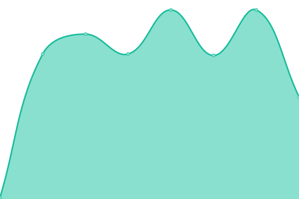 94ms
     
 | 

<a href="https://windstatus.github.io/Control-D-DNS-status-uptime-monitor/history/phx-dns">100.00%</a>
    

|  [PNQ - API](https://controld-network-api.ncprelief.eu.org?iata_code=PNQ&status=api) | 🟩 Up | [pnq-api.yml](https://github.com/windstatus/Control-D-DNS-status-uptime-monitor/commits/HEAD/history/pnq-api.yml) | 

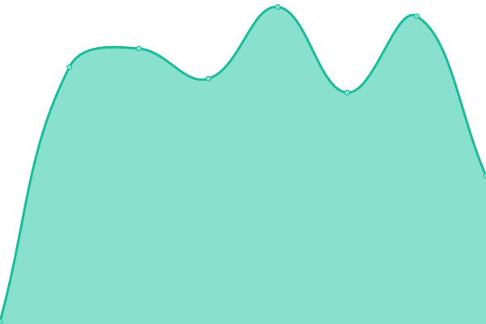 92ms
     
 | 

<a href="https://windstatus.github.io/Control-D-DNS-status-uptime-monitor/history/pnq-api">100.00%</a>
    

|  [PNQ - DNS](https://controld-network-api.ncprelief.eu.org?iata_code=PNQ&status=dns) | 🟩 Up | [pnq-dns.yml](https://github.com/windstatus/Control-D-DNS-status-uptime-monitor/commits/HEAD/history/pnq-dns.yml) | 

 92ms
     
 | 

<a href="https://windstatus.github.io/Control-D-DNS-status-uptime-monitor/history/pnq-dns">100.00%</a>
    

|  [RDU - API](https://controld-network-api.ncprelief.eu.org?iata_code=RDU&status=api) | 🟩 Up | [rdu-api.yml](https://github.com/windstatus/Control-D-DNS-status-uptime-monitor/commits/HEAD/history/rdu-api.yml) | 

 93ms
     
 | 

<a href="https://windstatus.github.io/Control-D-DNS-status-uptime-monitor/history/rdu-api">100.00%</a>
    

|  [RDU - DNS](https://controld-network-api.ncprelief.eu.org?iata_code=RDU&status=dns) | 🟩 Up | [rdu-dns.yml](https://github.com/windstatus/Control-D-DNS-status-uptime-monitor/commits/HEAD/history/rdu-dns.yml) | 

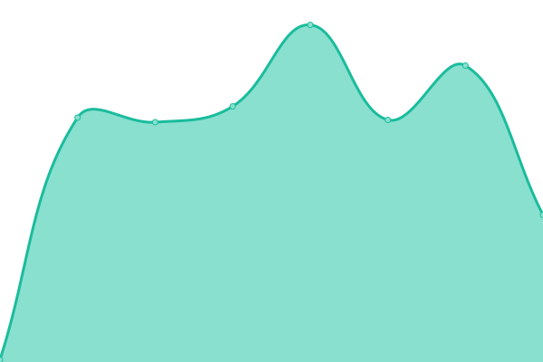 85ms
     
 | 

<a href="https://windstatus.github.io/Control-D-DNS-status-uptime-monitor/history/rdu-dns">100.00%</a>
    

|  [SCL - API](https://controld-network-api.ncprelief.eu.org?iata_code=SCL&status=api) | 🟩 Up | [scl-api.yml](https://github.com/windstatus/Control-D-DNS-status-uptime-monitor/commits/HEAD/history/scl-api.yml) | 

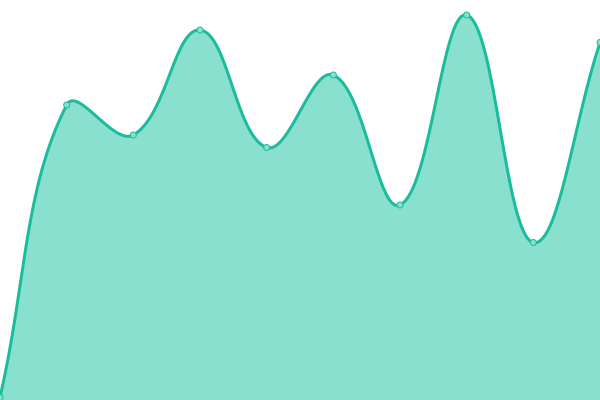 89ms
     
 | 

<a href="https://windstatus.github.io/Control-D-DNS-status-uptime-monitor/history/scl-api">100.00%</a>
    

|  [SCL - DNS](https://controld-network-api.ncprelief.eu.org?iata_code=SCL&status=dns) | 🟩 Up | [scl-dns.yml](https://github.com/windstatus/Control-D-DNS-status-uptime-monitor/commits/HEAD/history/scl-dns.yml) | 

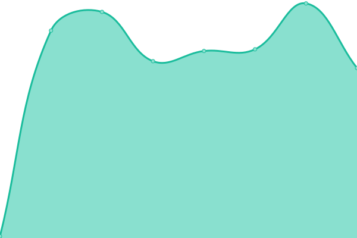 87ms
     
 | 

<a href="https://windstatus.github.io/Control-D-DNS-status-uptime-monitor/history/scl-dns">100.00%</a>
    

|  [SEA - API](https://controld-network-api.ncprelief.eu.org?iata_code=SEA&status=api) | 🟩 Up | [sea-api.yml](https://github.com/windstatus/Control-D-DNS-status-uptime-monitor/commits/HEAD/history/sea-api.yml) | 

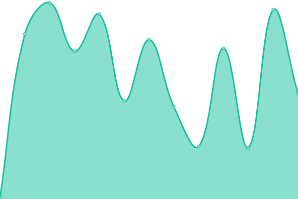 86ms
     
 | 

<a href="https://windstatus.github.io/Control-D-DNS-status-uptime-monitor/history/sea-api">100.00%</a>
    

|  [SEA - DNS](https://controld-network-api.ncprelief.eu.org?iata_code=SEA&status=dns) | 🟩 Up | [sea-dns.yml](https://github.com/windstatus/Control-D-DNS-status-uptime-monitor/commits/HEAD/history/sea-dns.yml) | 

 89ms
     
 | 

<a href="https://windstatus.github.io/Control-D-DNS-status-uptime-monitor/history/sea-dns">100.00%</a>
    

|  [SJC - API](https://controld-network-api.ncprelief.eu.org?iata_code=SJC&status=api) | 🟩 Up | [sjc-api.yml](https://github.com/windstatus/Control-D-DNS-status-uptime-monitor/commits/HEAD/history/sjc-api.yml) | 

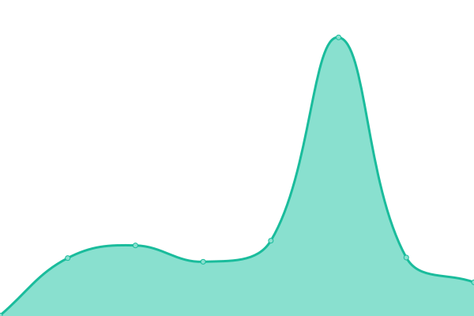 90ms
     
 | 

<a href="https://windstatus.github.io/Control-D-DNS-status-uptime-monitor/history/sjc-api">100.00%</a>
    

|  [SJC - DNS](https://controld-network-api.ncprelief.eu.org?iata_code=SJC&status=dns) | 🟩 Up | [sjc-dns.yml](https://github.com/windstatus/Control-D-DNS-status-uptime-monitor/commits/HEAD/history/sjc-dns.yml) | 

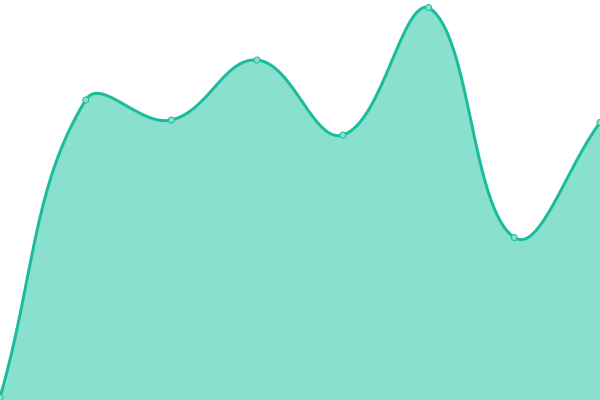 96ms
     
 | 

<a href="https://windstatus.github.io/Control-D-DNS-status-uptime-monitor/history/sjc-dns">100.00%</a>
    

|  [SOF - API](https://controld-network-api.ncprelief.eu.org?iata_code=SOF&status=api) | 🟩 Up | [sof-api.yml](https://github.com/windstatus/Control-D-DNS-status-uptime-monitor/commits/HEAD/history/sof-api.yml) | 

 91ms
     
 | 

<a href="https://windstatus.github.io/Control-D-DNS-status-uptime-monitor/history/sof-api">100.00%</a>
    

|  [SOF - DNS](https://controld-network-api.ncprelief.eu.org?iata_code=SOF&status=dns) | 🟩 Up | [sof-dns.yml](https://github.com/windstatus/Control-D-DNS-status-uptime-monitor/commits/HEAD/history/sof-dns.yml) | 

 94ms
     
 | 

<a href="https://windstatus.github.io/Control-D-DNS-status-uptime-monitor/history/sof-dns">100.00%</a>
    

|  [SOF - Proxy](https://controld-network-api.ncprelief.eu.org?iata_code=SOF&status=pxy) | 🟩 Up | [sof-proxy.yml](https://github.com/windstatus/Control-D-DNS-status-uptime-monitor/commits/HEAD/history/sof-proxy.yml) | 

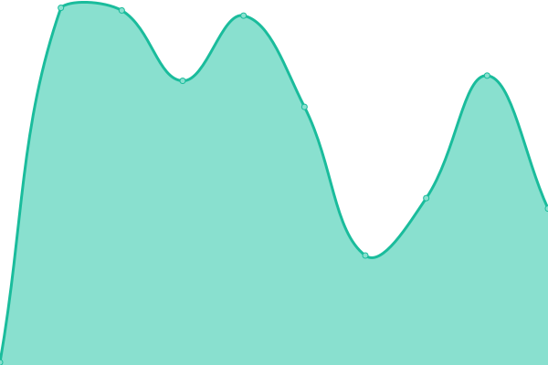 84ms
     
 | 

<a href="https://windstatus.github.io/Control-D-DNS-status-uptime-monitor/history/sof-proxy">100.00%</a>
    

|  [SYD - API](https://controld-network-api.ncprelief.eu.org?iata_code=SYD&status=api) | 🟩 Up | [syd-api.yml](https://github.com/windstatus/Control-D-DNS-status-uptime-monitor/commits/HEAD/history/syd-api.yml) | 

 87ms
     
 | 

<a href="https://windstatus.github.io/Control-D-DNS-status-uptime-monitor/history/syd-api">100.00%</a>
    

|  [SYD - DNS](https://controld-network-api.ncprelief.eu.org?iata_code=SYD&status=dns) | 🟩 Up | [syd-dns.yml](https://github.com/windstatus/Control-D-DNS-status-uptime-monitor/commits/HEAD/history/syd-dns.yml) | 

 93ms
     
 | 

<a href="https://windstatus.github.io/Control-D-DNS-status-uptime-monitor/history/syd-dns">100.00%</a>
    

|  [SYD - Proxy](https://controld-network-api.ncprelief.eu.org?iata_code=SYD&status=pxy) | 🟩 Up | [syd-proxy.yml](https://github.com/windstatus/Control-D-DNS-status-uptime-monitor/commits/HEAD/history/syd-proxy.yml) | 

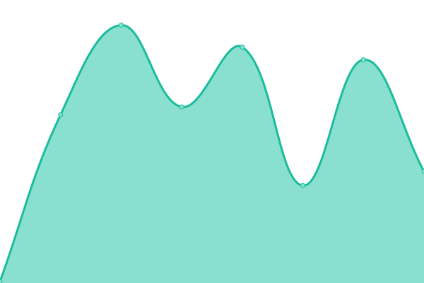 82ms
     
 | 

<a href="https://windstatus.github.io/Control-D-DNS-status-uptime-monitor/history/syd-proxy">100.00%</a>
    

|  [WAW - API](https://controld-network-api.ncprelief.eu.org?iata_code=WAW&status=api) | 🟩 Up | [waw-api.yml](https://github.com/windstatus/Control-D-DNS-status-uptime-monitor/commits/HEAD/history/waw-api.yml) | 

 86ms
     
 | 

<a href="https://windstatus.github.io/Control-D-DNS-status-uptime-monitor/history/waw-api">100.00%</a>
    

|  [WAW - DNS](https://controld-network-api.ncprelief.eu.org?iata_code=WAW&status=dns) | 🟩 Up | [waw-dns.yml](https://github.com/windstatus/Control-D-DNS-status-uptime-monitor/commits/HEAD/history/waw-dns.yml) | 

 88ms
     
 | 

<a href="https://windstatus.github.io/Control-D-DNS-status-uptime-monitor/history/waw-dns">100.00%</a>
    

|  [XSP - API](https://controld-network-api.ncprelief.eu.org?iata_code=XSP&status=api) | 🟩 Up | [xsp-api.yml](https://github.com/windstatus/Control-D-DNS-status-uptime-monitor/commits/HEAD/history/xsp-api.yml) | 

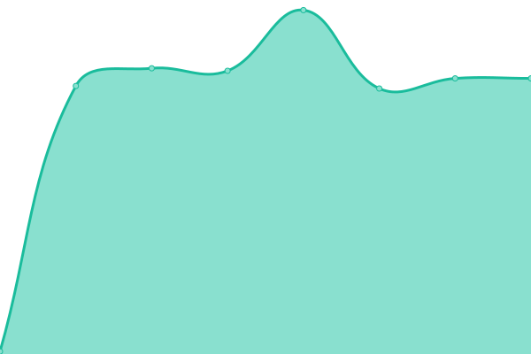 96ms
     
 | 

<a href="https://windstatus.github.io/Control-D-DNS-status-uptime-monitor/history/xsp-api">100.00%</a>
    

|  [XSP - DNS](https://controld-network-api.ncprelief.eu.org?iata_code=XSP&status=dns) | 🟩 Up | [xsp-dns.yml](https://github.com/windstatus/Control-D-DNS-status-uptime-monitor/commits/HEAD/history/xsp-dns.yml) | 

 87ms
     
 | 

<a href="https://windstatus.github.io/Control-D-DNS-status-uptime-monitor/history/xsp-dns">100.00%</a>
    

|  [XSP - Proxy](https://controld-network-api.ncprelief.eu.org?iata_code=XSP&status=pxy) | 🟩 Up | [xsp-proxy.yml](https://github.com/windstatus/Control-D-DNS-status-uptime-monitor/commits/HEAD/history/xsp-proxy.yml) | 

 94ms
     
 | 

<a href="https://windstatus.github.io/Control-D-DNS-status-uptime-monitor/history/xsp-proxy">100.00%</a>
    

|  [YYZ - API](https://controld-network-api.ncprelief.eu.org?iata_code=YYZ&status=api) | 🟩 Up | [yyz-api.yml](https://github.com/windstatus/Control-D-DNS-status-uptime-monitor/commits/HEAD/history/yyz-api.yml) | 

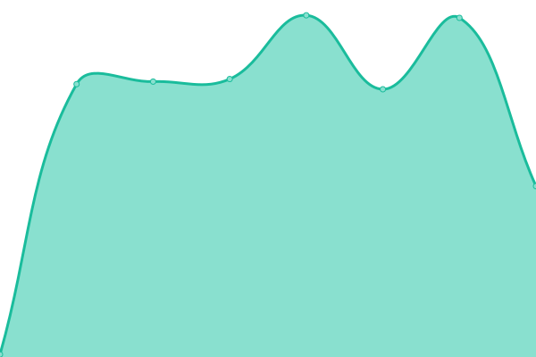 87ms
     
 | 

<a href="https://windstatus.github.io/Control-D-DNS-status-uptime-monitor/history/yyz-api">100.00%</a>
    

|  [YYZ - DNS](https://controld-network-api.ncprelief.eu.org?iata_code=YYZ&status=dns) | 🟩 Up | [yyz-dns.yml](https://github.com/windstatus/Control-D-DNS-status-uptime-monitor/commits/HEAD/history/yyz-dns.yml) | 

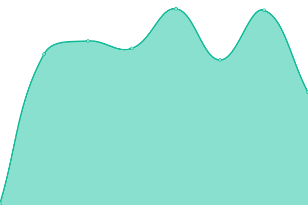 87ms
     
 | 

<a href="https://windstatus.github.io/Control-D-DNS-status-uptime-monitor/history/yyz-dns">100.00%</a>
    

|  [YYZ - Proxy](https://controld-network-api.ncprelief.eu.org?iata_code=YYZ&status=pxy) | 🟩 Up | [yyz-proxy.yml](https://github.com/windstatus/Control-D-DNS-status-uptime-monitor/commits/HEAD/history/yyz-proxy.yml) | 

 84ms
     
 | 

<a href="https://windstatus.github.io/Control-D-DNS-status-uptime-monitor/history/yyz-proxy">100.00%</a>
    

<!--end: status pages-->

[**Visit our status website →**](https://windstatus.github.io/Control-D-DNS-status-uptime-monitor)

## 📄 License

- Powered by: [Upptime](https://github.com/upptime/upptime)
- Code: [MIT](./LICENSE) © [Anand Chowdhary](https://anandchowdhary.com), supported by [Pabio](https://pabio.com)
- Data in the `./history` directory: [Open Database License](https://opendatacommons.org/licenses/odbl/1-0/)
